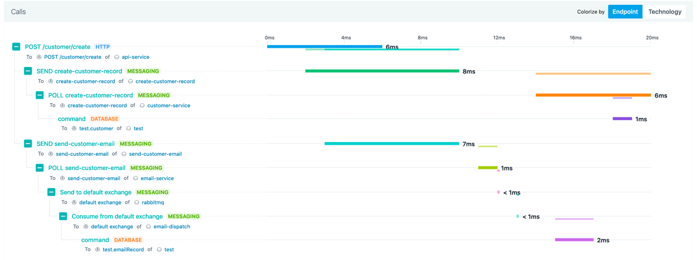

# Kafka / RabbitMQ functionality Demo

This small app publishes to some topics where consumers exist to do some work.

Basic functionality is covered in this demo for the purpose of showing how a distributed trace / flow actually appear.

Here is a flow chart designed with draw.io:


Here is a visualization of the services, topics, and rabbitmq queue using distributed logging and instana:


And finally, here is a distributed trace of a transaction flowing through this service:


## Getting Started

You'll need to have JDK 11 installed to build each image. Each service in this directory must be built using this command:

`mvn clean install -DskipTests docker:build`

Once built you can use docker-compose to boot the stack.

`docker-compose up -d`

You may need to restart the email service if the queue hasn't been created from generating a request.

## Generating Requests

There is a load generation script which will generate enough work to whorl fans on a 4 core machine.

```
cd scripts/load-test
docker build -t load-test .
docker run -it --network=host -e HOST=http://localhost:8080 -e NUM_CLIENTS=100 load-test
```

## Observing with Instana

You'll need to [sign up for a trial](https://www.instana.com/trial/) and [install the agent](https://docs.instana.io/quick_start/agent_setup/container/docker/).

## What is happening?

You should probably just take a look at the code, it's not too complex of a demo.